# Sen2ARD

## Index

1. [Introduction](#1-introduction)
2. [User Guide](#2-user-guide)
3. [Known Issues](#3-known-issues)
  
## 1. Introduction

Sen2TimeSeriesARD is an application that leverages the Google Earth Engine JavaScript (JS) API for the production of Analysis-Ready Data (ARD) time series by processing Sentinel 2 satellite images, also providing metadata on all parameters used and a complete list of the images used and their characteristics (Figure 1).

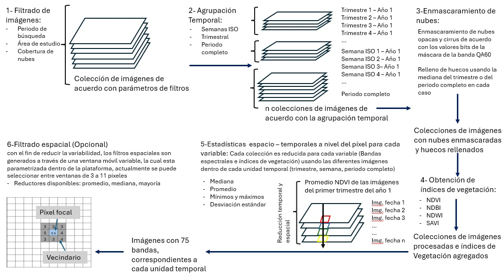
Figure 1. Main processes in the generation of remote sensing data through the application

The application has been developed using the GEE JavaScript API, which allows for the implementation of a simple user interface available for public use without the need for complex development and implementations (Figure 2).  

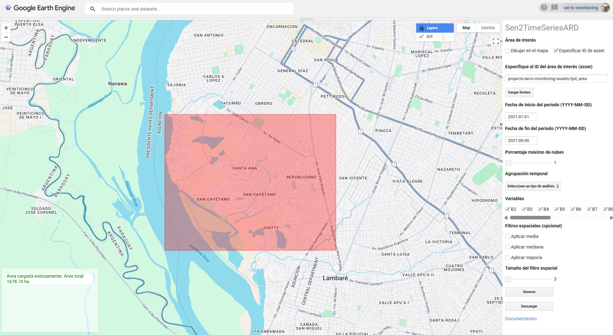
Figure 2. User interface of the application

### 1.2 Specifications

The application uses the *[Harmonized Sentinel-2 MSI: MultiSpectral Instrument, Level-2A (SR)](https://developers.google.com/earth-engine/datasets/catalog/COPERNICUS_S2_SR_HARMONIZED)* image collection, which is generated by downloading data from the [Copernicus Data Space Ecosystem](https://dataspace.copernicus.eu/) and processing it using the [sen2cor](https://scispace.com/pdf/sen2cor-for-sentinel-2-4n2d9rtbpz.pdf) algorithm to obtain data corrected for atmospheric effects, specifically the surface reflectance commonly known as *Bottom-Of-Atmosphere (BOA) reflectance products*.

This data is ideal for scientific and technical analyses that span multiple dates or time series, and thus has been considered the foundation of this application.

Currently, the application processes the following variables:

Table 1. Variables processed by the application

| Variable | Type | Typical Range | Native Resolution | Description |
|---|---|---|---|---|
| Band 2 | Spectral data | 0 - 0.4 | 10m | Blue - 496.6nm (S2A) / 492.1nm (S2B) |
| Band 3 | Spectral data | 0 - 0.4 | 10m | Green - 560nm (S2A) / 559nm (S2B) |
| Band 4 | Spectral data | 0 - 0.4 | 10m | Red - 664.5nm (S2A) / 665nm (S2B) |
| Band 5 | Spectral data | 0 - 0.4 | 20m | Red Edge 1 - 703.9nm (S2A) / 703.8nm (S2B) |
| Band 6 | Spectral data | 0 - 0.4 | 20m | Red Edge 2 - 740.2nm (S2A) / 739.1nm (S2B) |
| Band 7 | Spectral data | 0 - 0.4 | 20m | Red Edge 3 - 782.5nm (S2A) / 779.7nm (S2B) |
| Band 8 | Spectral data | 0 - 0.4 | 10m | Near Infrared - 835.1nm (S2A) / 833nm (S2B) |
| Band 8A | Spectral data | 0 - 0.4 | 20m | Red Edge 4 - 864.8nm (S2A) / 864nm (S2B) |
| Band 9 | Spectral data | 0 - 0.4 | 60m | Water vapor - 945nm (S2A) / 943.2nm (S2B) |
| Band 11 | Spectral data | 0 - 0.4 | 20m | Shortwave infrared 1 - 1613.7nm (S2A) / 1610.4nm (S2B) |
| Band 12 | Spectral data | 0 - 0.4 | 20m | Shortwave infrared 2 - 2202.4nm (S2A) / 2185.7nm (S2B) |
| NDVI | Spectral Index | -1 to +1 | 10m | Normalized Difference Vegetation Index |
| SAVI | Spectral Index | -1 to +1 | 10m | Soil-Adjusted Vegetation Index |
| NDBI | Spectral Index | -1 to +1 | 20m | Normalized Difference Built-up Index |
| NDWI | Spectral Index | -1 to +1 | 10m | Normalized Difference Water Index |

### 1.2.1 Cloud Filtering

Currently, the application performs pixel-level masking of opaque and cirrus clouds based on the QA60 band, and the resulting gaps are filled dynamically depending on the selected temporal aggregation type.

- Full Period: A single median image is generated from the entire image collection within the specified date range. This image is used as a filler for all masked images.

- Quarterly: For each quarter, a specific median is calculated for that quarter, using only the images contained within it. The gaps are filled with the composite of their respective quarter.

- ISO Weeks: To fill the gaps in a weekly image, the median of the quarter to which that week belongs is used. This approach ensures a temporally relevant and statistically robust filling.

This system will soon evolve to an optionally parameterized one that will include shadow masking.

### 1.2.2 Temporal Grouping

The application aggregates and temporally reduces the filtered images according to the AOI and the period of interest, obtaining central tendency statistics from the observations within each temporal unit:

- ISO Weeks: Images are grouped by ISO weeks according to the ISO 8601 standard, where week 1 of a year is the first week containing a Thursday.
- Quarterly: Images are grouped by quarters within each year following the standard Gregorian calendar.
- Full Period: The entire period indicated by the user is considered.

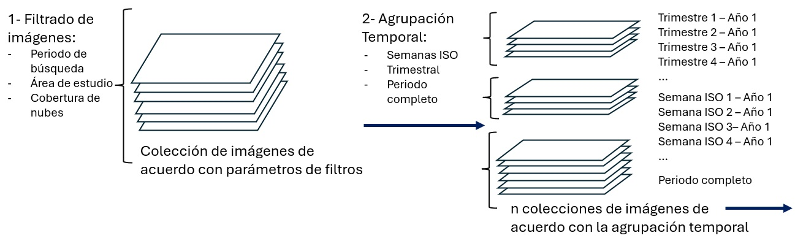
Figure 3. Temporal grouping of filtered images

The statistics calculated from the observations are:
- Average
- Median
- Minimum
- Maximum
- Standard deviation

 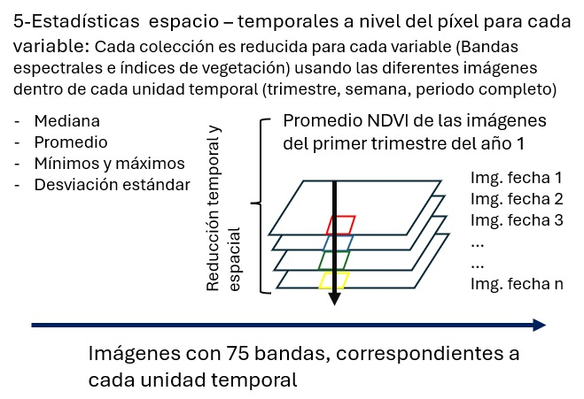

Figure 4. Spatio-temporal statistics at the pixel level

Thus, we currently have 15 variables and 5 statistics calculated per temporal unit, which produces a total of 75 bands corresponding to the statistics of each of the spatially explicit variables.

### 1.2.3 Spatial Filtering (Optional)

Optionally, the application can apply spatial filters to the temporally grouped products. These filters modify the value of each pixel using its neighborhood to calculate the mean, median, or mode (majority). To do this, a square window or "kernel" is used, whose size is adjusted with the "Spatial filter size" parameter, which defines the number of pixels per side of said window.

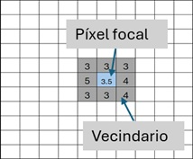

Figure 5. Spatial filtering

## 2. User Guide

Once you have created an account on [Google Earth Engine](https://earthengine.google.com/signup/), you can copy the repository to your GEE account through the following [link](https://code.earthengine.google.com/?accept_repo=users/charlieswall/proy_conacyt_pinv01_528). Then the corresponding scripts will be displayed in the Scripts > Reader section (Figure 6).

You will find more information about the operation of the GEE JavaScript API through the following [link](https://developers.google.com/earth-engine/tutorials/tutorial_api_01).

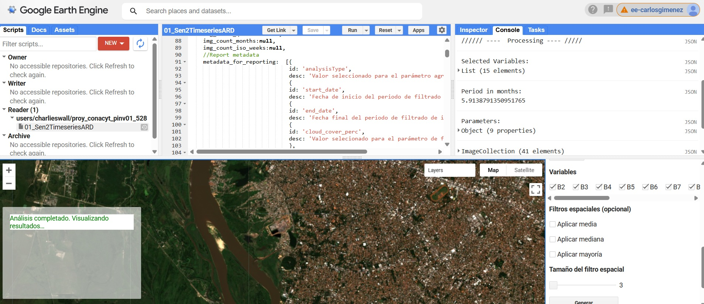
Figure 6. User interface of the application

### 2.1. Accessing the application
 Once you have access to the application script, you must run it by clicking the "RUN" button. The application will be deployed showing the user interface, as can be seen in figure 1. Once the interface is deployed, the user must specify a series of parameters necessary to run the application.
   
### 2.2. Parameters

Here the parameters are listed sequentially:

+ **Areas of interest (AOI):** The area of interest can be specified through the use of GEE assets (checked by default) or by drawing it on the map by checking the "Draw on map" option, then the polygon must be loaded into the application through the "Load boundaries" button.
   
   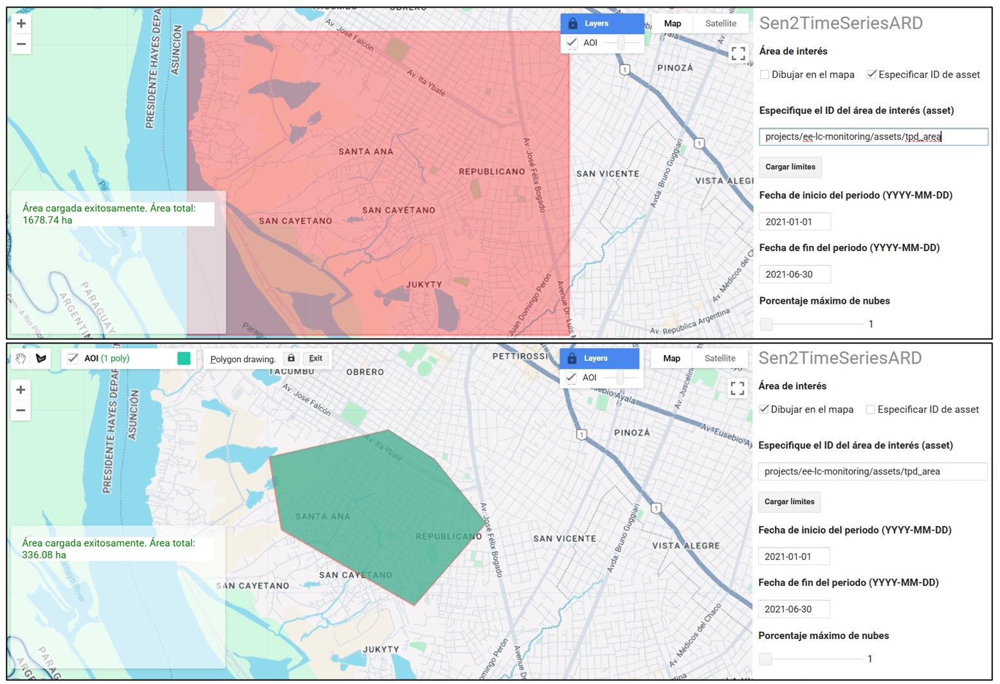
   Figure 7. Area of interest (AOI) loading options
   

The application will process the study area and generate messages in the panel in the lower-left corner, where, among other things, the estimated area of the AOI will appear.

It is important to mention here that the application has a size limitation for the study area (250,000 ha) imposed intentionally, this is to avoid errors due to exceeding the computing capacity of the users. Intermediate and advanced users can modify this limit at their discretion.
   
+ **Start and end dates of the period of interest:** users must specify the start and end date of the application period in the format (YYYY-MM-DD). The application will validate the period taking into account the type of temporal grouping specified or simply the validity of the period itself (figure 8).
  
  It is important to keep in mind that the images considered will depend mainly on the search period, that is, the images found between the start and end date.
  
  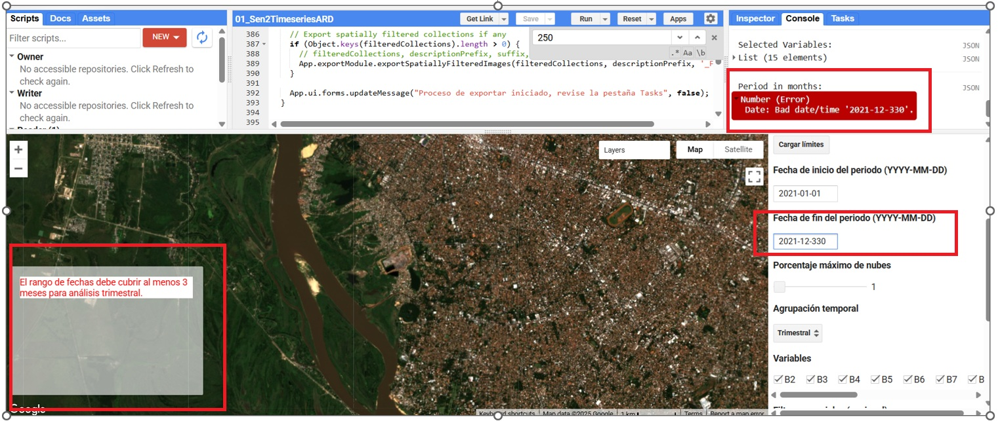
  Figure 8. Search period validation

By default, the application calculates the period in months, this can be verified in the "Console" tab where this and other information are shown, as well as potential errors that could arise from GEE.

+ **Maximum percentage of clouds:** the user must specify the maximum allowed cloud cover value, this value is compared with the value of the 'CLOUDY_PIXEL_PERCENTAGE' field of each sentinel image, excluding all images above the provided value.
  
+ **Temporal grouping:** the user must choose the type of temporal aggregation to which the images will be subjected. This value defines how the collection will be divided (Quarterly, ISO Weeks or Full period). In each case, the period will be validated according to the chosen temporal unit, for example, if the "Quarterly" grouping is chosen, the application will calculate and require a minimum period of 3 months. On the other hand, if the grouping by ISO weeks is chosen, the period will be required to cover at least 1 ISO week.
    
    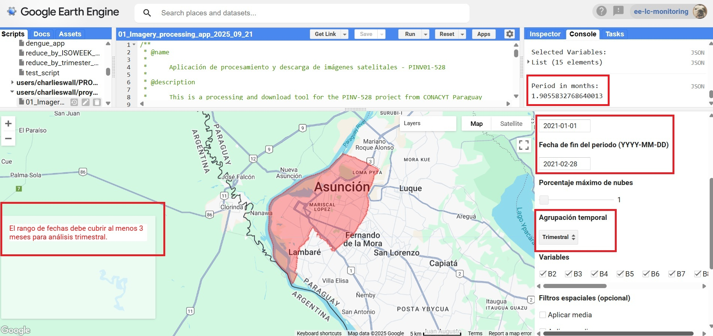
    Figure 9. Choice of temporal grouping.
    
    The temporal grouping options are described below:

    **a-) Quarterly:** in this grouping mode, the collection data is grouped according to the quarters of each year within the period. It is important to keep in mind that only the filtered data is considered and images are not added to cover the full period, that is, if the period partially covers certain quarters, the data within each quarter will only be made up of the images filtered in that period and according to the other parameters.

    **b-) ISO Weeks:** the images are grouped by ISO weeks according to the ISO 8601 standard where week 1 of a year is the first week that contains a Thursday.

    **c-) Full period:** in this mode, the temporal grouping unit is simply the search period. This grouping mode allows maximum flexibility in terms of temporal filters.

+ **Variables**: it is possible to select which variables will be included for processing. Currently, the application has 15 variables, among which are 11 spectral bands and 4 vegetation indices (NDVI, NDWI, NDBI and SAVI) (see table 1).

+ **Spatial filters (optional)**: Optionally, the application can apply spatial filters on the products already grouped temporally. These filters modify the value of each pixel using its neighborhood to calculate the mean, median or mode (majority). For this, a square window or "kernel" is used, whose size is adjusted with the "Spatial filter size" parameter, which defines the number of pixels per side of said window.

### 2.3 Processing and iterative review
Once all the parameters have been specified, the process must be executed by clicking on the "Generate" button. The results will be generated and printed in the GEE interface console. Likewise, compositions will be added to the map using the median of each temporal unit in order to visually observe the results.

Each time the "Generate" button is executed, the application will proceed to collect all the parameters, generate the query and process the groupings and filters according to what has been specified. In this way, it is possible to test the parameters and verify the results both in the console and on the map.

In the following example, we will use the city of Asunción, Paraguay, as a study area, and we will verify the results by applying the following parameters:

- period: 2021-01-01, 2021-06-30
- Maximum percentage of clouds: 1 %
- Temporal grouping: Quarterly
- Variables: 15 variables (B2-B12, NDVI, NDWI, NDBI, SAVI)
- Spatial filters: mean, median and majority
- Spatial filter size: 3 pixels

As mentioned previously, each time the "Generate" button is executed, the application will print a new "Processing" section in the console, under which the parameters used and data related to the analyzed results of the images will be displayed, such as:

 - The selected variables: the list of processed variables
 - Period in months: the period covered by the start and end date in months
 - Parameters: list of parameters used and results such as: image count, ISO weeks within the period, ISO weeks with and without data according to the results, total number of images, quarters present, among others.
  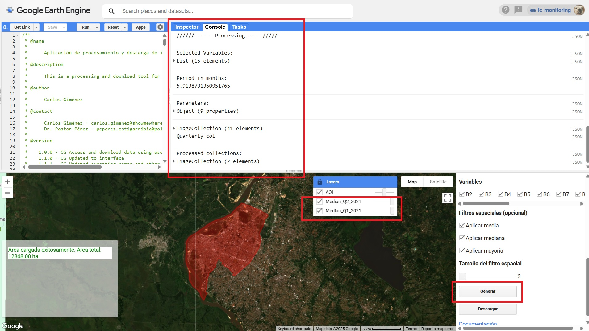
  Figure 10. Results printed in the console

In the example in Figure 11, the "img_count_total" field reports the number of filtered images, the "img_count_iso_weeks" field presents the ISO weeks that recorded data in the "YYYY_ISO_WEEK" format. Likewise, the months with data are also presented in the "YYYY-MM" format and the quarters present in the search period through the "img_count_quarters" field in "YYYY-Quarter" format

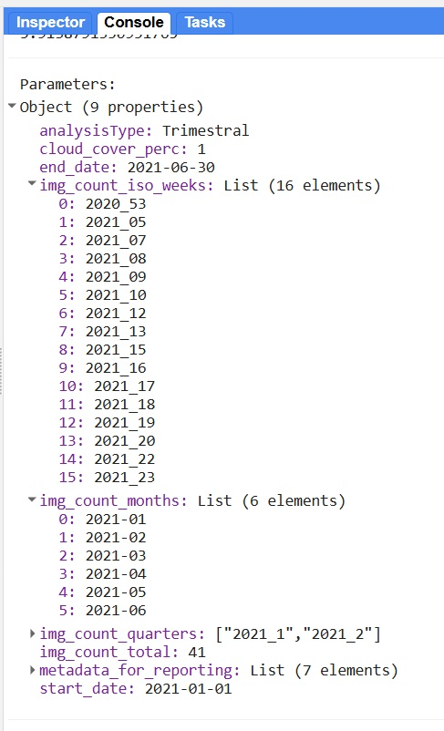

Figure 11. Summary of data processed by the application

 - Filtered image collection (ImageCollection): collection of images containing the total of images filtered according to the study area, period and cloud cover. This variable is useful for reviewing the images present within the processed data, such as: number of images per grid, number of images per month and the id of each image in case you want to view them individually.

 - Processed collection: contains one image for each temporal unit found, that is, in our example, 2 quarters were found in the data, so an image was generated for each quarter. The application also generates properties of each set of images used for the composition of each resulting image, such as the number of images grouped by temporal unit through the "image_count" field, the date of the first and last image in temporal order using the "start_date" and "end_date" fields (Figure 12)
  
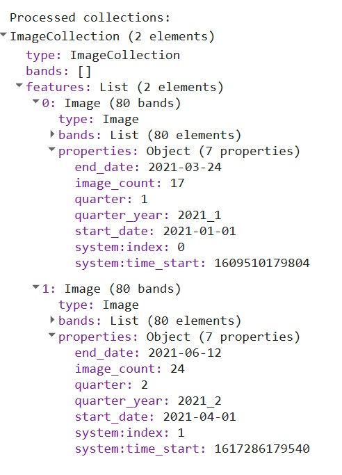

Figure 12. Resulting image data

Each image contains the different variables processed, for example for the variables B2 and NDVI, B2_mean, B2_max, B2_min, B2_median, B2_stdDev and NDVI_mean, NDVI_max, NDVI_min, NDVI_median, NDVI_stdDev were generated as can be seen in figure 13.

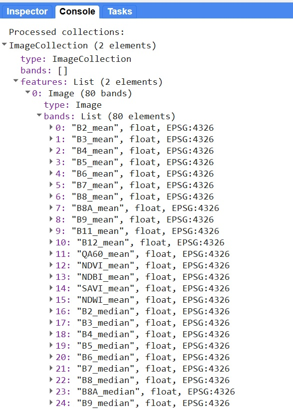

Figure 13. Resulting image data

### 2.4 Downloads

Once the generated data has been analyzed, you can start the data download process by clicking on the "Download" button, which will execute the final processes for the download. Then the files ready for download will appear in the "Tasks" window of the GEE API, where the user must press "RUN" for each file to be downloaded.

Finally, for each file, the download details will be displayed, which can be edited by the user.

 The download module is designed to export a complete and organized set of results to your Google Drive space, allowing you to later use the data in other software such as QGIS or R.

Currently the application is capable of exporting three types of files:
  
+ Data in *.tif* format: multiband rasters per temporal unit, that is, for example, if the analysis corresponds to the quarters of the year 2024, the application will generate 4 rasters corresponding to Q1, Q2, Q3 and Q4 of 2024, each containing spatially explicit temporal statistics (min, max, mean, median and standard deviation) of the set of Sentinel 2 data filtered in that period in the area of interest.

+ Detailed list of images and their characteristics in *.csv* format, including data such as their GEE ID, cloud cover and grid.

+ Configuration and results data such as: type of analysis performed, date of analysis, period analyzed, cloud cover threshold, ISO weeks with images found, months with images, total image count.

Once the "Download" button has been pressed, a new "Downloads" section will be printed in the GEE console, where you will find:

- The collection of processed images: images resulting from the temporal reduction applied according to the specified unit.

- Application messages regarding the process and exported files: The application is capable of exporting in batches in order to manage requests to the GEE server more efficiently and thus avoid memory overload problems.

- Names of the exported files according to the standardized nomenclature:
  - Quarterly: Quarter_ + Q + quarter number + _ + Year + _ + year
    
    Example: Quarter_Q1_Year_2021
  - ISO Weeks: ISO + _ + week + _ + Week + ISO week number + _ + Year + _ + 2021
    
    Example: ISO_week_Week5_Year_2021

  - Full period: Period + _ + YYYY + - + MM + - + DD _ + to + _ + YYYY + - + MM + - + DD
    
    Example: Period_2021-01-01_to_2021-06-12

Additionally, when you want to export the rasters corresponding to the spatial filters, the prefix "spf" corresponding to "spatially filtered" is added, then the size of the window used, for example "3", the type of reducer, for example "mean" for average and the word "Filtered".

In the following figure you can see the files ready for download displayed in the "Tasks" window of the GEE API.

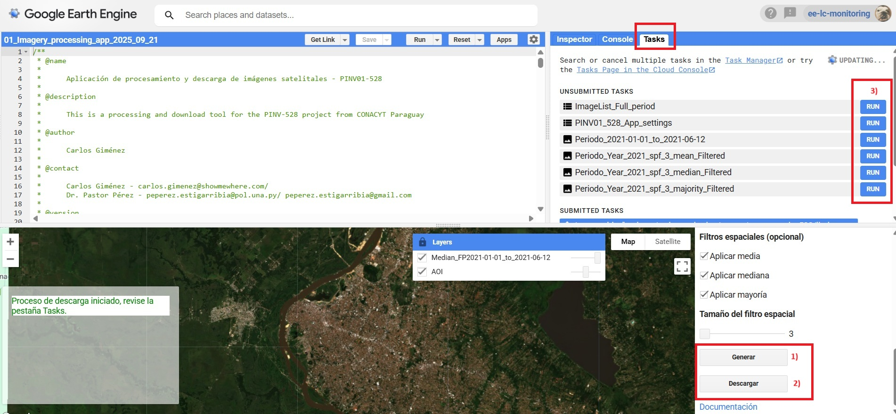

Figure 14. Resulting image data

It is important to mention that these names are modifiable, either by modifying the App's programming or directly when exporting the files.

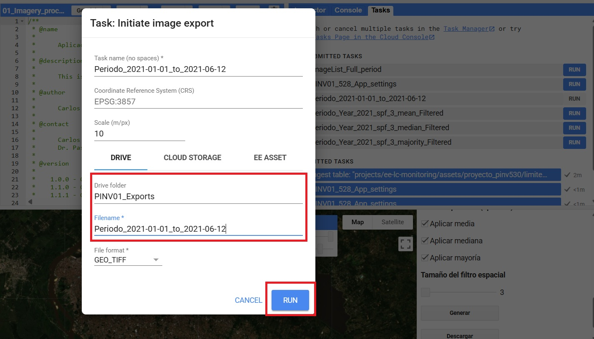

Figure 15. Resulting image data

## 3. Known Issues:

- After running "Generate" and "Download", depending on the number of temporal units generated, a "freeze" will be observed. This is because the application uses the getInfo function for certain activities that require information from the server to the client.
  
- It is very important to keep in mind that this application is designed within the GEE API and it has memory limitations for certain types of users, so it is strongly advised not to analyze areas that are too extensive in periods with multiple temporal units.
  
- The application is still under full development and ideally new features will be included in the future. If you find bugs or other operational problems, please contact carlos.gimenez@showmewhere.com or peperez.estigarribia@pol.una.py# Sen2TimeSeriesARD
This is the repository of the Sen2TimeSeriesARD Google Earth Engine application, which enables the generation of time series remote sensing data ready for analysis 
